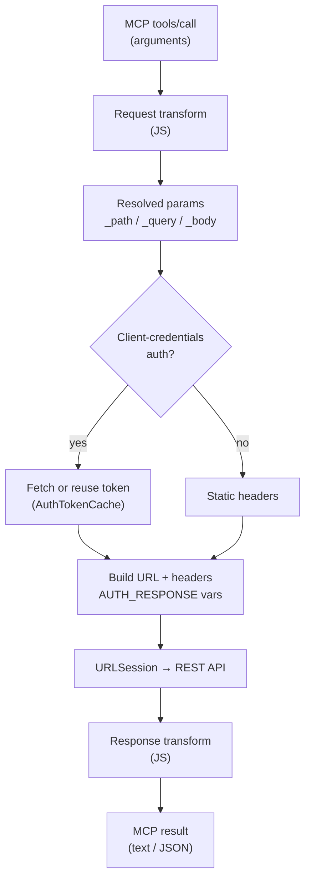
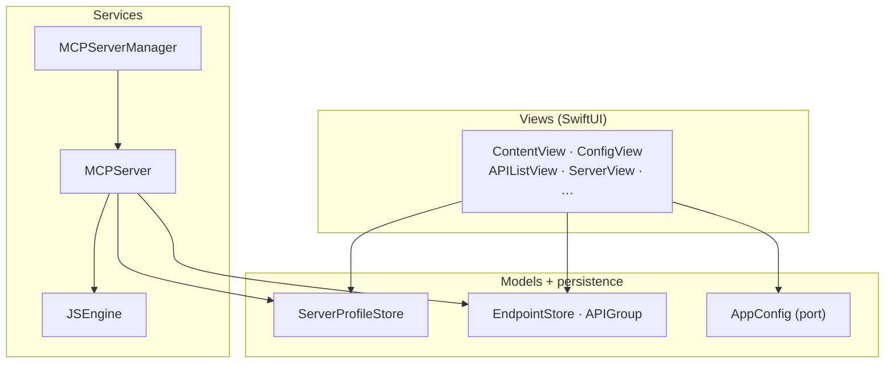
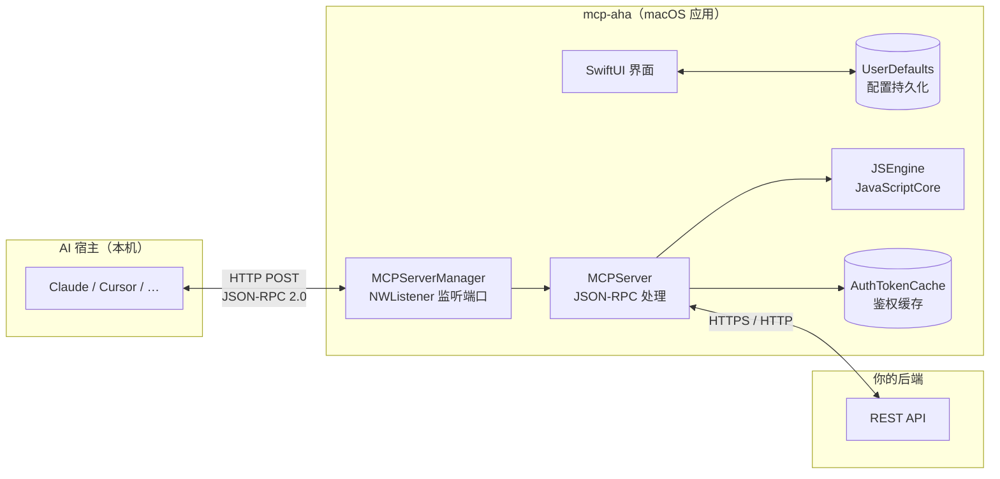
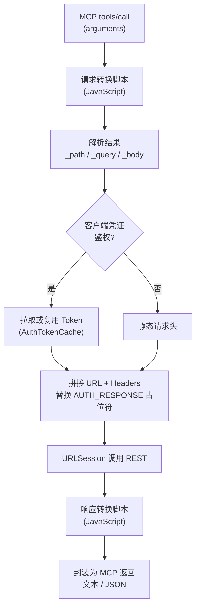
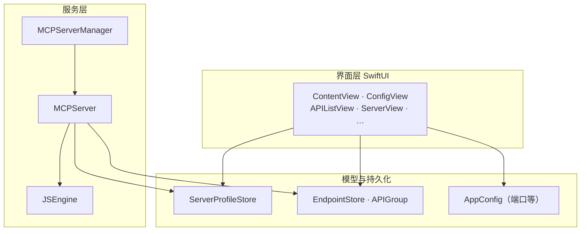

# mcp-aha

[](./LICENSE)
[](https://developer.apple.com/macos/)
[](https://swift.org)
[](https://developer.apple.com/xcode/)
[](https://modelcontextprotocol.io)
[](./releases)

Tired of **waiting forever** for bespoke MCP work, or **burning days** hand-wrapping every REST surface as yet another “skill”? **mcp-aha** meets your stack where it already is: **plain HTTP**. Point a native macOS UI at your APIs, add **small JavaScript transforms** only when shapes differ, and let assistants speak **MCP** while your backends stay **REST**.

**REST authentication (per server profile)**  
- **Static / header-based** — A JSON object of outbound headers: e.g. long-lived **`Authorization: Bearer …`**, **`X-Api-Key`**, vendor-specific keys, or **`Authorization: Basic …`** (you supply the full header value your gateway expects).  
- **Client-credentials style token fetch** — `POST` JSON to your **auth URL**, cache the JSON response, then splice fields into headers with **`${AUTH_RESPONSE.fieldName}`** placeholders, refreshed on a **configurable TTL** (minutes).

**Language / 语言:** **English** (default) · [简体中文](#chinese)

---

<a id="english"></a>

## English

**mcp-aha** is the app behind the pitch above: a native **macOS** client that turns **REST APIs** into **MCP** tools for Claude, Cursor, and other hosts—without replacing your HTTP services.

### Features

- **Visual API management** — add, edit, delete endpoints; organize with groups  
- **Multiple server profiles** — per-server base URL and auth  
- **Flexible auth** — static token or client-credentials flow with auto refresh  
- **JavaScript transforms** — JavaScriptCore runs request/response mapping scripts  
- **MCP protocol** — JSON-RPC, including `tools`, `resources`, `prompts`, etc.  
- **One-click import** — Cursor, Claude Desktop, Claude Code  
- **Import / export** — full configuration as JSON  

### Download

Installable **macOS** builds (`.dmg`) are on **[Releases](./releases)**. Open the DMG, drag **mcp-aha** into **Applications**.  
Requires **macOS 13+**. Pre-built DMGs are currently **Apple Silicon (arm64)**; Intel users can build from source with Xcode.

### Project layout

```
mcp-aha/
├── project.yml              # XcodeGen spec
├── Resources/
│   ├── Info.plist
│   ├── mcp-aha.entitlements
│   └── Assets.xcassets/
└── Sources/
    ├── App/McpAhaApp.swift
    ├── Models/              # Config, ServerProfile, APIEndpoint, APIGroup
    ├── Views/               # SwiftUI screens
    └── Services/            # MCPServer, JSEngine, APIGateway
```

### Architecture

#### End-to-end data flow


#### Core logic: `tools/call`



#### Module map



### Requirements

- macOS 13.0+  
- Xcode 15.0+  
- Swift 5.9+  
- [XcodeGen](https://github.com/yonaskolb/XcodeGen) (optional, to generate the Xcode project)  

### Build

```bash
brew install xcodegen   # if needed
cd mcp-aha
xcodegen generate
```

Open the generated `mcp-aha.xcodeproj`, select the **mcp-aha** scheme, run (⌘R).

Command line:

```bash
xcodegen generate
xcodebuild -project mcp-aha.xcodeproj -scheme mcp-aha -configuration Debug build
```

Build products go under Xcode’s DerivedData (not committed).

To produce a **Release DMG** locally (output under `release/`):

```bash
./scripts/package-dmg.sh
```

### Usage (short)

1. **Servers** — add a profile: name, base URL, headers (e.g. `Authorization`). Use client-credentials mode if tokens must be fetched automatically; `${AUTH_RESPONSE.xxx}` is supported in templates.  
2. **APIs** — define name, description, path (`{param}` supported), method, server, and input JSON Schema.  
3. **Transforms** — optional JS for request (`_path` / `_query` / `_body`) and response shaping.  
4. **Service** — pick a port (default `3000`), start the MCP HTTP server.  
5. **Connect** — use **Import** for Cursor / Claude Desktop, or configure your client with the shown MCP URL.  

Example client snippet:

```json
{
  "mcpServers": {
    "mcp-aha": {
      "url": "http://127.0.0.1:3000/mcp"
    }
  }
}
```

Claude Code example:

```bash
claude mcp add --transport http --url http://127.0.0.1:3000/mcp mcp-aha
```

### MCP routes

- `/mcp` — all enabled tools  
- `/{server-slug}/mcp` — tools for one server only  

Slugs are derived from the server display name (e.g. pinyin for CJK names).

### Security note

Transform scripts run **locally** in JavaScriptCore with your app’s privileges. Only load configs and scripts you trust.

### Technical notes

- MCP revision: **2024-11-05**  
- Transport: **HTTP POST**, JSON-RPC 2.0  
- Persistence: **UserDefaults**  

### License

MIT — see [LICENSE](LICENSE).

---

<a id="chinese"></a>

## 简体中文

**等 MCP 定制排期等到心焦，还是把每个 REST 接口都包成「Skills」又慢又累？** **mcp-aha** 让现有 **HTTP 服务**直接变成 **MCP 工具**：在 Mac 原生界面里配服务器与端点，只在参数或响应形状不一致时写几行 **JavaScript**，助手走 MCP，后端仍是 REST。

**支持的 REST 认证（按服务器配置）**  
- **静态请求头** — 用 JSON 配置任意出站 Header：例如长期有效的 **`Authorization: Bearer …`**、**`X-Api-Key`**、厂商自定义头，或 **`Authorization: Basic …`**（由你填入网关要求的完整值）。  
- **客户端凭证 / 换票** — 向 **鉴权 URL** `POST` JSON，缓存返回的 JSON；在请求头里用 **`${AUTH_RESPONSE.字段名}`** 占位符注入字段，按 **过期时间（分钟）** 自动刷新再拉取。

### 功能特性

- **可视化 API 管理**：增删改端点，支持分组  
- **多服务器配置**：每个服务器独立的 Base URL 与认证  
- **灵活认证**：静态 Token 或客户端凭证模式（自动获取/刷新 Token）  
- **JavaScript 转换**：使用 JavaScriptCore 执行请求/响应脚本  
- **MCP 协议**：完整 JSON-RPC（tools、resources、prompts 等）  
- **一键导入**：Cursor、Claude Desktop、Claude Code  
- **导入/导出**：JSON 全量配置  

### 下载安装

在 **[Releases](./releases)** 下载 **macOS** 安装包（`.dmg`），打开后把 **mcp-aha** 拖入「应用程序」。  
需要 **macOS 13+**。当前预编译包为 **Apple Silicon (arm64)**；Intel 设备可用 Xcode 从源码编译。

### 项目结构

```
mcp-aha/
├── project.yml              # XcodeGen 配置
├── Resources/
│   ├── Info.plist
│   ├── mcp-aha.entitlements
│   └── Assets.xcassets/
└── Sources/
    ├── App/McpAhaApp.swift
    ├── Models/
    ├── Views/
    └── Services/
```

### 架构与数据流

#### 端到端数据流



#### 核心逻辑：`tools/call`



#### 模块关系



### 环境要求

- macOS 13.0+  
- Xcode 15.0+  
- Swift 5.9+  
- [XcodeGen](https://github.com/yonaskolb/XcodeGen)（可选）  

### 本地开发

```bash
brew install xcodegen
cd mcp-aha
xcodegen generate
```

用 Xcode 打开 `mcp-aha.xcodeproj`，选择 **mcp-aha** scheme，运行 (⌘R)。

命令行编译：

```bash
xcodegen generate
xcodebuild -project mcp-aha.xcodeproj -scheme mcp-aha -configuration Debug build
```

打包 **Release DMG**（生成到 `release/` 目录）：

```bash
./scripts/package-dmg.sh
```

### 使用说明（摘要）

1. **服务器**：名称、Base URL、请求头；客户端凭证模式支持 `${AUTH_RESPONSE.xxx}`。  
2. **API**：名称、描述、路径（支持 `{param}`）、方法、服务器、输入 JSON Schema。  
3. **转换脚本**：请求（`_path` / `_query` / `_body`）与响应可选 JS。  
4. **服务**：端口（默认 3000），启动 MCP HTTP 服务。  
5. **接入 AI**：使用「导入」或按各客户端文档配置 MCP URL。  

### MCP 路由

- `/mcp`：全部已启用 API  
- `/{server-slug}/mcp`：仅该服务器下的 API  

服务器 slug 由显示名称自动生成（中文名会转拼音等），例如名称「销售接口」可能对应 `/xiao-shou-jie-kou/mcp`。

### 安全说明

转换脚本在本地 **JavaScriptCore** 中以应用权限执行，请只使用可信的配置与脚本。

### 技术细节

- 协议版本：MCP 2024-11-05  
- 传输：HTTP POST（JSON-RPC 2.0）  
- 持久化：UserDefaults  

### 许可证

MIT，见 [LICENSE](LICENSE)。

**[↑ 回到顶部 / Back to top](#mcp-aha)** · **[English](#english)**
